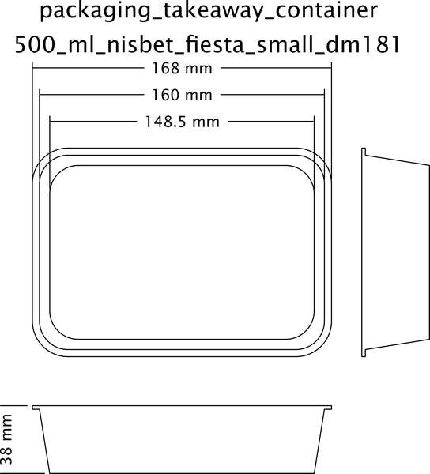
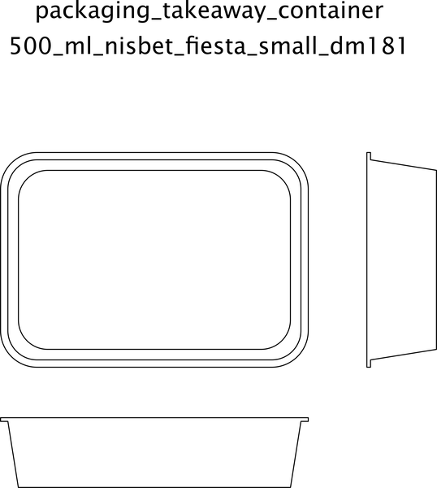

# Packaging Takeaway Container Rectangle 500 Ml Nisbet Fiesta Small Dm181  

note: This is part of OOMP the Oopen Organization Method For Parts. For more details: https://github.com/oomlout/oomp_base

##  part details

### id
* oomp_id: packaging_takeaway_container_rectangle_500_ml_nisbet_fiesta_small_dm181
  * classification: packaging
  * type: takeaway_container_rectangle
  * size: 500_ml
  * color: 
  * description_main: 
  * description_extra: 
  * manufacturer: nisbet_fiesta
  * part_number: small_dm181

### other_codes
* short_code: 
* oomp_word: hammer cupid briefcase
* oomp_word_emoji :hammer: :cupid: :briefcase:
* md5_6_alpha: 5cipd
* md5_6: 890eb1